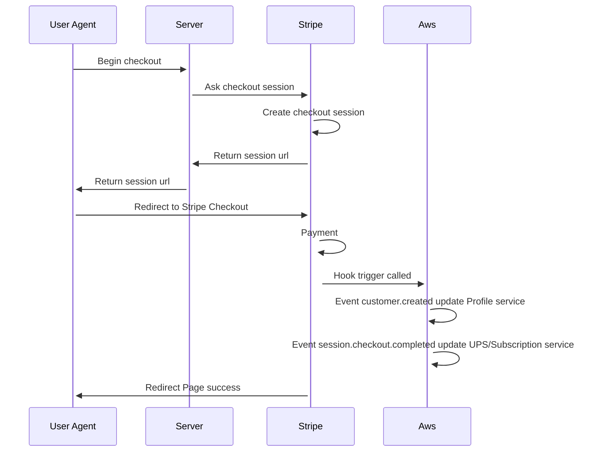

# Service Messages

Ce service permet de laisser des messages à destination des annonceurs. Pour cela 

* Obtention d'une session de paiement auprès de **STRIPE**
* Ventilation des crédits ou abonnements dans le compte du *client*

## Business Rules

        Workflow
                
                up2go          stripe                        up2go
         ____________  ________________________________   _____________
        /            \/                                \ /             \
        -->  Panier  ---> Checkout  ---> Confirmation  ---> A determiner 
            (anonyme)	(identifié)     (identifié)         (identifié)

| id                | Description                                                                                                                                   |
|:------------------|:----------------------------------------------------------------------------------------------------------------------------------------------|
|`CHECK_1`          | Un utilisateur doit être identifié pour acceder à la "Page Checkout"                                                                          |
|`CHECK_2`          | La page checkout doit comporter le logo du marchand(up2go, auto-moto) Note HBO: Nous conseillons de créer des comptes différents par marchand |
|`CHECK_3`          | Le récapitulatif de la commande doit comporter les informations suivantes: N° de commande, de pack (formules), le tarif.                      |
|`CHECK_4`          | Fonctionnalité code promo. Création de code promo + consommation Note HBO: Activation depuis l'interface stripe.com                           |
|`CHECK_5`          | La page de confirmation doit comporter les informations suivantes: Texte Welcome, N° de transaction, de pack (formules), le tarif acquitée.   |
|`CHECK_6`          | Une fois le paiement confirmé l'acheteur reçoit un email avec le résumé de la commande                                                        |
|`CHECK_7`          | Une fois le paiement confirmé, génération d'une facture visible dans le compte admin du client dans « mes commandes »                         |

## Technical Rules

### Schema

### Session de Paiement

Tous les champs suivants sont **obligatoires**. Ils doivent être envoyés au microservice. Cela demarre une session qui permet aux clients de payer leurs souscription ou d'acheter des UPS

| id                | Description                                                               |
|:------------------|:--------------------------------------------------------------------------|
|`form_url`         | A poster vers le microservice, permet d'obternir le checkout session      |
|`mode`             | Mode de paiement plusieurs valeurs sont possibles voir doc stripe         |
|`priceId`          | Un produit comporte plusieurs prix, préciser ici le prix attendu          |
|`customerStripeId` | Réference stripe du client                                                |
|`customerEmail`    | Email du client, permet d'associer ce client au retour *Stripe*           |
|`advertiserId`     | Id de l'annonceur, permet d'associer cet annonceur au retour *Stripe*     |
|`profileId`        | Id profile de l'acheteur, permet d'associer ce profile au retour *Stripe* |
|`successUrl`       | Url de redirection en cas de succès                                       |
|`cancelUrl`        | Url de redirection en cas d'annulation/echec                              |

### Example
Pour obtenir une session de paiement procédé comme suit:

    <form action="https://xxxxx.execute-api.eu-west-1.amazonaws.com/create-checkout-session" method="POST">
        <input type="hidden" name="mode" value="payment" />
        <input type="hidden" name="priceId" value="price_xxxxx" />
        <input type="text" name="customerStripeId" value="cus_xxxx" />
        <input type="text" name="customerEmail" value="customer@email.com" />
        <input type="text" name="advertiserId" value="79d1c487-0819-4748-9d1f-de29f4353c1f" />
        <input type="text" name="profileId" value="c14de1ff-20d9-47c9-bb93-4f3c582f3b6c" />
        <input type="hidden" name="successUrl" value="http://example.com/success.html" />
        <input type="hidden" name="cancelUrl" value="http://example.com/cancel.html" />
        <button type="submit" id="submit">Buy</button>
    </form>
