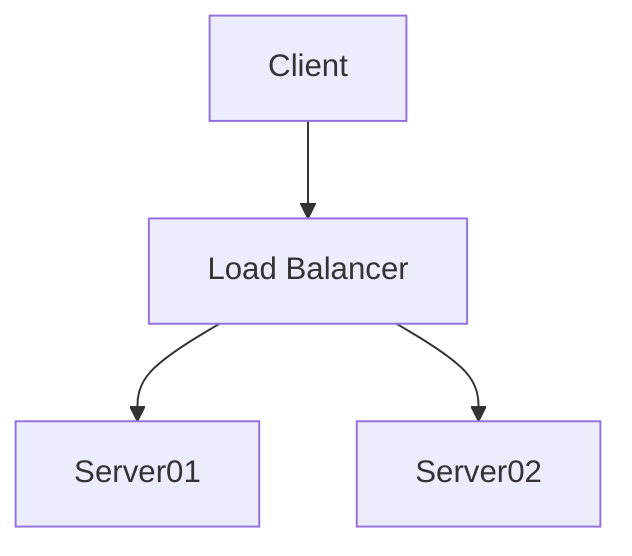

# Stripe

Le service de paiment Stripe offre des possibilités de gestion des tarifs et des souscriptions.

* Les docs techniques de Stripe sont disponibles à cette adresse: `https://stripe.com/docs/js`
* Les docs techniques de Stripe sont disponibles à cette adresse: `https://stripe.com/docs`

## Business Rules

Toutes les règles de gestion suivantes sont à paramétrer dans Stripe et les parcours sont à faire côté backoffice si besoin.

| id    |                                                                                                                                                         |
|:------|:--------------------------------------------------------------------------------------------------------------------------------------------------------------------------------------------------------------------------------------------------------------------------------------------------------------|
|ABO_2  | Offre découverte elle permet de séduire et d’impliquer le profesionnel. Le pro pourra choisir parmi les 3 abonnements, qu’ils soit avec ou sans                                   engagement.Offert durant 1 mois, puis tacitement sur l’offre en question s’il n’a pas « résilié ».|
|ABO_3  | Dans le menu mon abonnement se trouve une cases pour ne pas reconduire tacitement ainsi que le solde de ses up's et la formule d'abonnement en cours |
|ABO_4  | L'activation de l'offre découverte"1 mois essai offert", doit se faire à la date de publication de la première annonce, pas à la date de création du                             compte |
|ABO_5  | Un professionnel peut opter pour un abonnement mensuel de 25, 50 ou 100 annonces **avec engagement** 12 mois. Le tarif sur 12 mois est moins chère de                            8,33% (équivalent d’un mois offert) Date de souscription : 28-02-2021, date de fin le 27-02-2022 à 00 :00 :00
|ABO_6  | Un abonnement avec engagement est reconduit tacitement à la date anniversaire pour 12 mois |
|ABO_7  | Un professionnel peut opter pour un abonnement mensuel de 25, 50 ou 100 annonces sans engagement.- Date de souscription : 28-02-2021, date de fin le 27-                        03-2021 à 00 :00 :00 - Un abonnement sans engagement est reconduit tacitement à la date anniversaire pour 1 mois |
|ABO_8  | Est inclus des credits (Up’s) dans chaqu'une des offres avec ou sans engagement : Classic : 60 up’s - Professionnel : 125 up’s - Ultimate : 250 up’ss |
|ABO_9  | Les prélèvements se font mensuellement |
|ABO_10 | Activation des offres d'abonnement immédiatement après paiement (annonces et  y compris up’s) |
|ABO_12 | Pas de blocage du compte en cas de non paiement |
|ABO_13 | Possibilité de payer les abonnements via le checkout par CB |
|ABO_14 | Possibilité pour UPTOGO de modifier les tarifs des abonnements et quantité d'annonces d'un abonnement. |
|ABO_15 | Possibilité pour l'équipe d'UPTOGO d'attribuer à un professionnel un abonnement menuellement/annuel si règlement hors site (un virement par exemple) |
|ABO_13 | Possibilité pour UPTOGO de modifier les tarifs des abonnements et quantité d'annonces d'un abonnement. |
|ABO_17 | Pour le professionnel possibilité d'upgrader ou downgrader son abonnement le mois suivant qu’il soit avec ou sans engagement. |
|ABO_18 | Sans engagement : Souscrit le 28-02-2021 prise en compte du changement le mois suivant le 28-03-2021 à 00 :00 :01 |
|ABO_19 | Avec engagement 12 mois : Souscrit le 28-02-2021 date anniversaire dans 1 an-le 27-03-2022 à 00 :00 :00 prise en compte du changement le mois suivant le                         28-03-2021 00 :00 :01|
|ABO_20 | Possibilité pour l'équipe d'UPTOGO depuis le backoffice d'activer plus tot l'offre (Exemple : soucription à l'offre 25 annonces le 15/07/2021, le                                 22/07/21 le client décide de passer à l'offre supérieure,celle-ci sera effective le 15/07/2021 sauf si nous la forcons) |
|ABO_21 | Facture créée automatiquement et disponible dans l'onglet du client "mes commandes". |

## Technical Rules

### Schema

